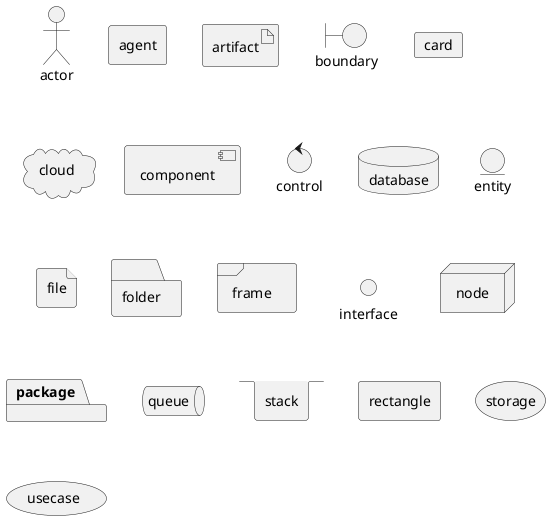

# Design
## markdown demo

```plantuml format="svg_inline"

!include <cloudinsight/tomcat>
!include <cloudinsight/kafka>
!include <cloudinsight/java>
!include <cloudinsight/cassandra>

title Cloudinsight sprites example

skinparam monochrome true

rectangle "<$tomcat>\nwebapp" as webapp
queue "<$kafka>" as kafka
rectangle "<$java>\ndaemon" as daemon
database "<$cassandra>" as cassandra

webapp -> kafka
kafka -> daemon
daemon --> cassandra

```

```plantuml format="svg_inline"
robust "DNS Resolver" as DNS
robust "Web Browser" as WB
concise "Web User" as WU

@0
WU is Idle
WB is Idle
DNS is Idle

@+100
WU -> WB : URL
WU is Waiting
WB is Processing

@+200
WB is Waiting
WB -> DNS@+50 : Resolve URL

@+100
DNS is Processing

@+300
DNS is Idle
```

```plantuml format="svg_inline" classes="uml myDiagram" alt="My super diagram placeholder" title="My super diagram"
  Goofy ->  MickeyMouse: calls
  Goofy <-- MickeyMouse: responds
```

```plantuml format="svg_inline"
  Goofy ->  MickeyMouse: calls2
  Goofy <-- MickeyMouse: responds
```

```plantuml format="svg_inline"
skinparam monochrome true
autonumber 10 10 "<b>[000]"
Bob -> Alice : Authentication Request
Bob <- Alice : Authentication Response

autonumber stop
Bob -> Alice : dummy

autonumber resume "<font color=red><b>Message 0  "
Bob -> Alice : Yet another authentication Request
Bob <- Alice : Yet another authentication Response

autonumber stop
Bob -> Alice : dummy

autonumber resume 1 "<font color=blue><b>Message 0  "
Bob -> Alice : Yet another authentication Request
Bob <- Alice : Yet another authentication Response
```



```plantuml format="svg_inline"
folder folder [
This is a <b>folder
----
You can use separator
====
of different kind
....
and style
]

node node [
This is a <b>nodees1
----
You can use separator
====
of different kind
....
and style
]

database database [
This is a <b>database
----AQ1f
You can use separator
====
of different kind
....
and style
]

usecase usecase [
This is a <b>usecase
----
You can use separator
====
of different kind
....
and style
]
```
$$ AVG=\frac{HITS}{AT\ BATS} $$

```flow
st=>start: Start:>http://www.google.com[blank]
e=>end:>http://www.google.com
op1=>operation: My Operation
sub1=>subroutine: My Subroutine
cond=>condition: Yes
or No?:>http://www.google.com
io=>inputoutput: catch something...
st->op1->cond
cond(yes)->io->e
cond(no)->sub1(right)->op1
```

```sequence
Title: Here is a title
A->B: Normal line
B-->C: Dashed line
C->>D: Open arrow
D-->>A: Dashed open arrow
```
